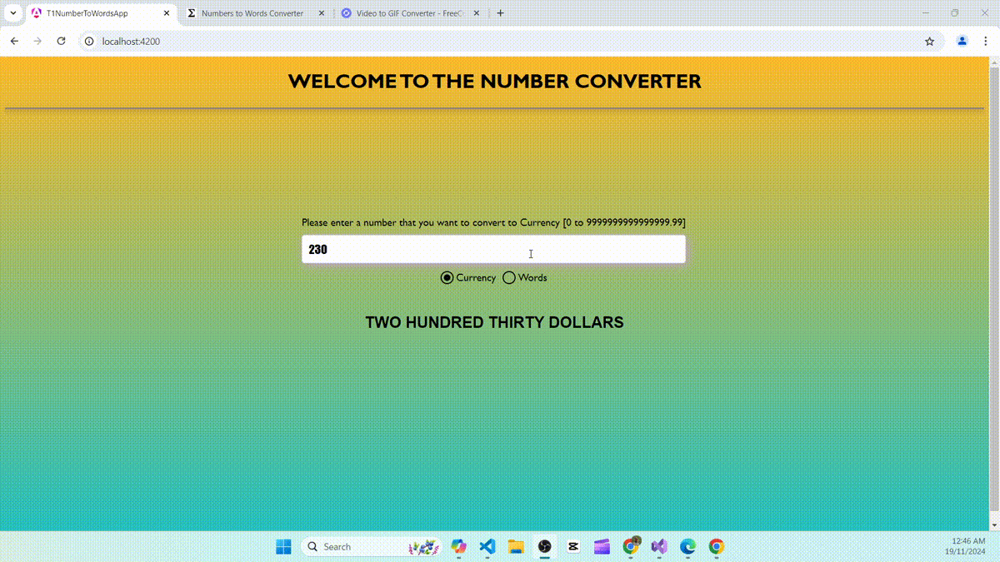

# T1NumberToWordsApp

This project was generated with [Angular CLI](https://github.com/angular/angular-cli) version 18.2.11.

## Prerequisites

You will need Node version >=22.x.0. Please download from https://nodejs.org/en/download/package-manager

Run npm i or npm install to install packages to node modules. This will install the packages listed in package.json.

## Development server

Run `ng serve` for a dev server. Navigate to `http://localhost:4200/`.

## Build

Run `ng build` to build the project. The build artifacts will be stored in the `dist/` directory.
